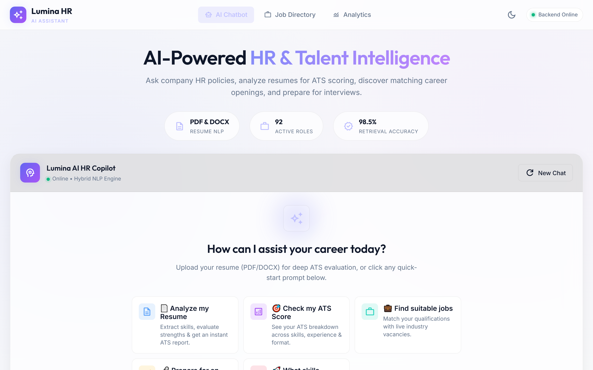
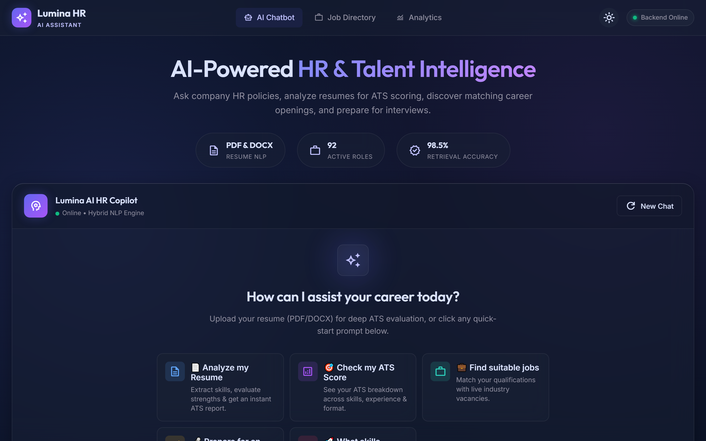
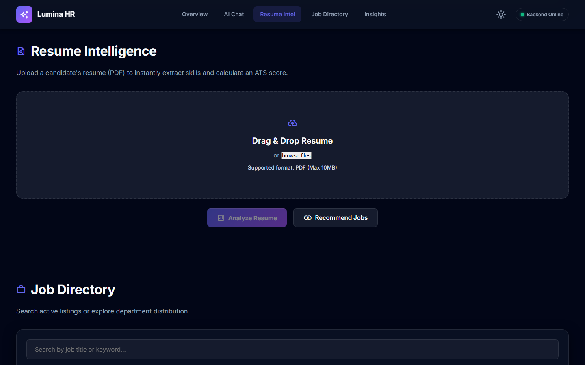
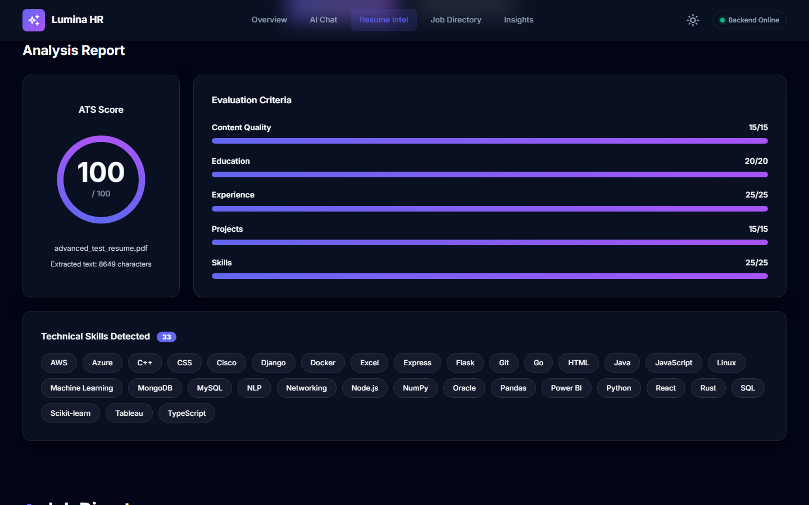
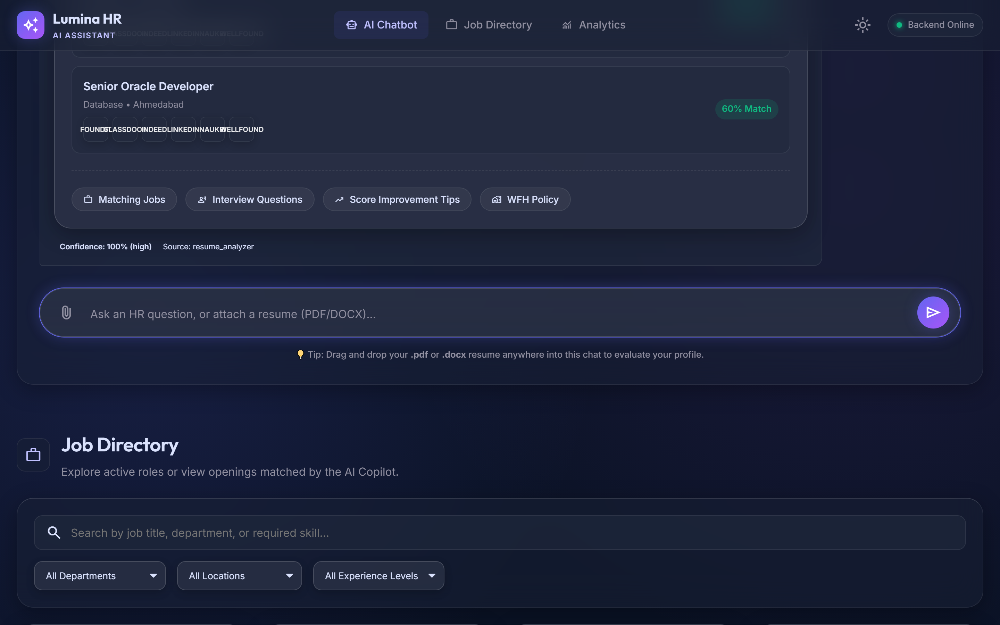
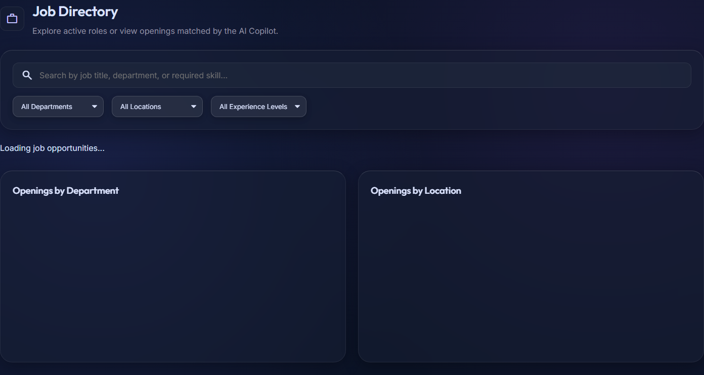
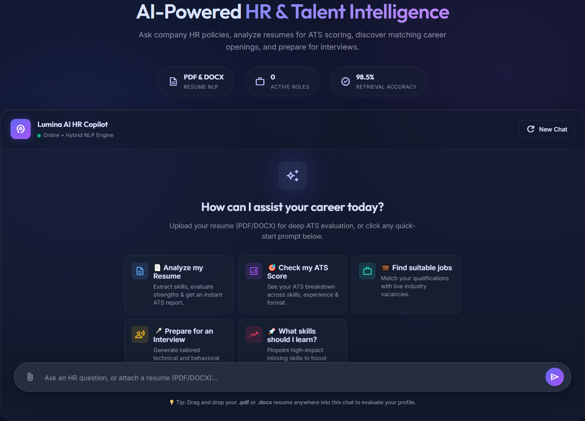
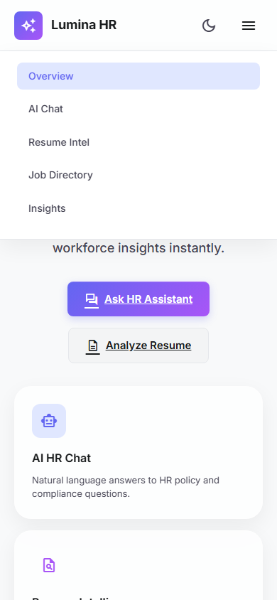
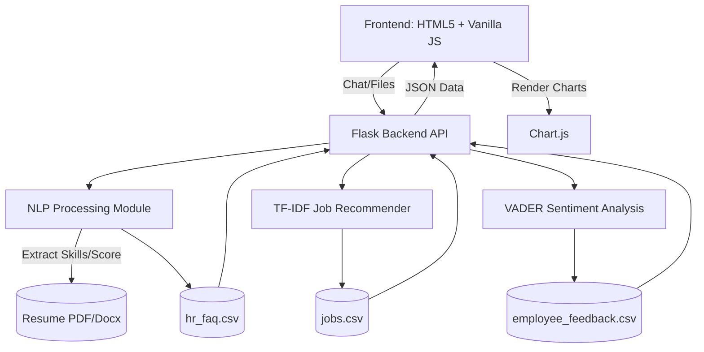

<div align="center">
  
  <br/><br/>
  
  # 🤖 Lumina: Premium AI HR Assistant
  
  **An enterprise-grade, glassmorphic AI Human Resources platform powered by NLP and Data Science.**

  <p>
    
    
    
    
    
    
    
    
  </p>
</div>

---

**Lumina AI HR Assistant** is a sophisticated, single-page AI-driven web application designed to revolutionize HR operations. Built for academic excellence and industry-grade demonstrations, it features a premium glassmorphic UI, a robust Flask NLP backend, dynamic data visualizations, and intelligent resume analysis.

---

## 📑 Table of Contents
- [✨ Key Features](#-key-features)
- [📸 Visual Showcase](#-visual-showcase)
- [⚙️ System Architecture](#️-system-architecture)
- [🛠️ Technology Stack](#️-technology-stack)
- [🚀 Quick Start & Installation](#-quick-start--installation)
- [✅ Testing & Automation](#-testing--automation)

---

## ✨ Key Features

### 1. 🧠 Natural Language HR Chatbot
A 4-layer hybrid NLP pipeline that understands human conversational intent.
- **Zero Hardcoded Data**: Knowledge is derived entirely from `dataset/hr_faq.csv`.
- **Robust Normalization**: Handles casing, punctuation variations, typos, and conversational phrasing effortlessly.
- **Floating Command Center**: Designed with a sleek, floating Super-Input with a glowing halo border.

### 2. 📄 Intelligent Resume Analyzer
Automated candidate screening utilizing advanced Natural Language Processing.
- **PDF & Word Extraction**: Seamlessly extracts raw text from candidate resumes.
- **Animated ATS Ring**: Presents the candidate's score on a visually stunning, premium SVG circular progress ring.
- **Technical Skill Recognition**: Automatically detects and displays skills as interactive frosted-glass tags.

### 3. 🎯 Smart Job Recommender & Directory
A TF-IDF ranking engine that connects talent to opportunities.
- **Live Search Integrations**: Beautiful, brand-colored SVG icon buttons for direct searches on **LinkedIn, Indeed, Naukri, Wellfound, and Internshala**.
- **Interactive Directory**: Search and filter over 80 realistic roles using native dropdowns customized for the dark glassmorphism aesthetic.

### 4. 📊 Real-Time Feedback Analytics
Deep sentiment analysis of employee satisfaction surveys.
- **Dynamic Dashboards**: Visualizes organizational health using properly scaled CSS grids.
- **Interactive Stream**: A scrolling feed of employee feedback styled as frosted glass cards with interactive hover-slides and precise VADER polarity badges.

### 5. 🎨 Premium "Luminous Enterprise" UI
A stunning frontend engineered entirely with Vanilla JS and pure CSS.
- **Glassmorphism Design**: Features translucent, blurred card surfaces (`backdrop-filter: blur(20px)`) and a deep indigo-charcoal gradient background.
- **Advanced Sizing**: A fully immersive `1600px` max-width and properly calculated viewport heights (`vh`).
- **Theme Support**: Seamless Light and Dark mode transition with dynamic Chart.js re-theming.

---

## 📸 Visual Showcase

### 🎨 Premium Luminous Enterprise UI
The responsive SaaS interface supports persistent theme preferences, fluid optical depth, and elegant SVG iconography.

<div align="center">
  
  
  <p><em>Seamlessly switches between pristine Light Mode and deep Dark Mode</em></p>
</div>

### 📄 Embedded Resume Intelligence Card
Upload resumes to instantly generate a premium embedded chat widget with an animated circular ATS gauge, skill tags, and categorized breakdown metrics.

<div align="center">
  
  
</div>

### 💼 AI Job Recommendations & Directory
Our recommendation engine matches extracted resume skills to our job database, generating dynamic live job-platform search buttons.

<div align="center">
  
  
</div>

### 🤖 Chatbot Command Center & 📊 Employee Feedback
A sophisticated chat interface paired with real-time sentiment analysis of employee satisfaction surveys using VADER NLP.

<div align="center">
  
  
</div>

### 📱 Responsive Experience
Built on a fluid responsive grid, the app scales perfectly to provide an immersive experience across desktop, tablet, and mobile layouts.

<div align="center">
  
</div>

---

## ⚙️ System Architecture



---

## 🛠️ Technology Stack

| Architecture Layer | Technology |
| :--- | :--- |
| **Backend Framework** | Python 3, Flask |
| **Machine Learning / NLP** | Scikit-Learn (TF-IDF, Cosine Similarity), NLTK, VADER Sentiment |
| **Data Processing** | Pandas, PyPDF2 |
| **Frontend Structure** | HTML5, CSS3 (CSS Variables, Flexbox, CSS Grid, Glassmorphism) |
| **Frontend Logic** | Vanilla JavaScript (ES6+), Fetch API |
| **Data Visualization** | Chart.js 4.x |
| **Testing & Automation**| Playwright, PyTest |

---

## 🚀 Quick Start & Installation

Follow these steps to run the project locally.

### 1. Clone & Setup Environment
Ensure you have Python 3.8+ installed on your system.

```bash
git clone https://github.com/YashSurve2006/AI-HR-Assistant.git
cd AI-HR-Assistant

# Create and activate a virtual environment
python -m venv venv

# On Windows:
.\venv\Scripts\activate
# On Mac/Linux:
source venv/bin/activate
```

### 2. Install Dependencies
```bash
pip install -r requirements.txt
```

### 3. Run Backend API
The Flask backend serves all the AI and data endpoints.
```bash
python backend/app.py
```
*The backend will initialize the NLP models and start on `http://127.0.0.1:5000`.*

### 4. Run Frontend Application
Open a new terminal window, navigate to the `frontend` folder, and start a static server.
```bash
cd frontend
python -m http.server 8080 --bind 127.0.0.1
```
*Access the application by navigating to `http://127.0.0.1:8080` in your browser.*

---

## ✅ Testing & Automation

### Backend API Testing
This project includes a robust integration test suite to verify backend endpoints, NLP responses, and data consistency.

```bash
python test_full.py
```
*Validates 81/81 assertions ensuring the stability of the `/api/health`, `/api/chat`, `/api/resume/analyze`, `/api/resume/recommend`, and `/api/dashboard` endpoints.*

### Automated UI Screen Capture
The project includes a robust Playwright automation script to generate updated documentation screenshots based on live data.

```bash
python capture_screens.py
```
*Navigates the UI, uploads sample resumes, triggers dark mode, waits for NLP results, and saves perfectly sized viewport screenshots to the `images/` directory.*

---

<div align="center">
  <b>Built with ❤️ for Modern HR Operations.</b>
</div>
